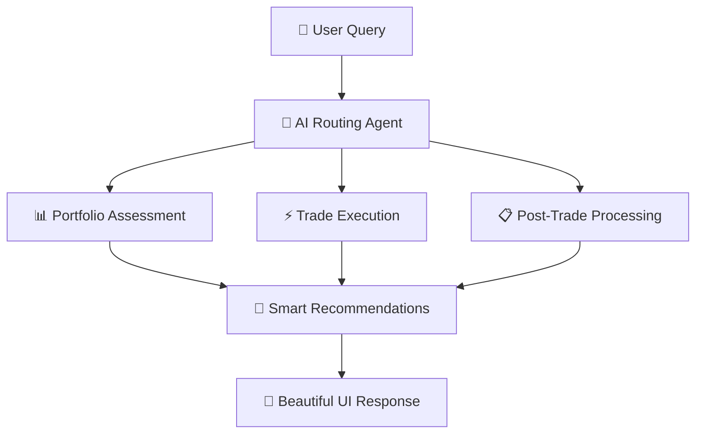

# DTCC AI Hackathon 2025: Empowering India's Innovators
The purpose of hackathon is to leverage AI and ML Technologies to address critical challenges in the financial markets. The overall goal is to progress industry through Innovation, Networking and by providing effective Solutions.

**Hackathon Key Dates** 
•	June 6th - Event invites will be sent to participants
•	June 9th - Hackathon Open
•	June 9th-11th - Team collaboration and Use Case development
•	June 12th - Team presentations & demos
•	June 16th - Winners Announcement

More Info - https://communications.dtcc.com/dtcc-ai-hackathon-registration-17810.html

Commit Early & Commit Often!!!

# 🚀 Investica
### *AI-Powered Financial Assistant for Next-Gen Trading*

<div align="center">


**Revolutionizing portfolio management through intelligent AI agents**

[🎯 Live Demo](#-demo) • [📖 Documentation](#-table-of-contents) • [🛠️ Setup](#-quick-start) • [🤝 Contribute](#-contributing)

</div>

---

## 🌟 Overview

**Investica** is a cutting-edge AI-powered financial assistant that transforms how retail investors approach portfolio management and trading. Built for the **DTCC i-Hack 2025 - Drishtikon**, our platform leverages advanced agentic AI workflows to deliver seamless integration between Indian markets (via Zerodha Kite API) and global financial insights.

### 🎯 What Makes Investica Special?



---

## ✨ Core Features

<table>
<tr>
<td width="50%">

### 🔍 **Intelligent Portfolio Analysis**
- **Real-time Assessment**: Live portfolio health monitoring
- **Multi-source Data**: Combines Zerodha + global financial data
- **AI Insights**: Advanced recommendation engine
- **Risk Analytics**: Comprehensive risk profiling

</td>
<td width="50%">

### ⚡ **Smart Trade Execution**
- **Market Optimization**: Real-time condition analysis
- **Automated Trading**: GTT and conditional orders
- **Multi-asset Support**: Stocks, derivatives, and more
- **Performance Tracking**: Live P&L monitoring

</td>
</tr>
<tr>
<td width="50%">

### 🤖 **Agentic AI Workflow**
- **7 Specialized Agents**: Each optimized for specific tasks
- **Natural Language**: Chat-based interface
- **Memory Persistence**: Context-aware conversations
- **Workflow Orchestration**: Seamless agent collaboration

</td>
<td width="50%">

### 🌐 **Global Market Intelligence**
- **Indian Markets**: Full Zerodha Kite integration
- **US Markets**: Comprehensive financial datasets
- **Crypto Insights**: Digital asset analysis
- **News Integration**: Real-time market sentiment

</td>
</tr>
</table>

---

## 🏗️ Architecture Deep Dive

### 🤖 Meet the AI Agents

<div align="center">

| Agent | Role | Technology | Key Features |
|-------|------|------------|-------------|
| 🧭 **Routing Agent** | Query orchestration | Claude + AWS Bedrock | NLP parsing, task distribution |
| 📊 **Portfolio Assessor** | Investment analysis | Pydantic AI | Risk assessment, recommendations |
| 🎯 **Trade Executor** | Order management | LangGraph | Smart execution, optimization |
| 📋 **Post-Trade Manager** | Settlement processing | MCP Protocol | Reconciliation, reporting |
| 🌍 **Financial Analyst** | Global data analysis | Financial Datasets API | Fundamental analysis, insights |
| 💹 **Zerodha Agent** | Indian market interface | Kite API | Trading, portfolio data |
| 📤 **Output Agent** | Response synthesis | Streamlit | Visualization, user experience |

</div>

### 🔄 Workflow Architecture


## 🛠️ Technology Stack

<div align="center">

### **Agentic AI Infrastructure**


### **Frontend & UI**


### **Data & APIs**


</div>

---

## 🚀 Quick Start

### 📋 Prerequisites

- **Python 3.11+** 🐍
- **Git** 📚
- **AWS Bedrock Access** ☁️
- **SupaBase Account** 🗄️

### 🔑 Required API Keys

| Service | Purpose | Get From |
|---------|---------|----------|
| 🏦 Zerodha Kite | Indian market trading | [kite.trade](https://kite.trade) |
| 📈 Financial Datasets | Global market data | [financialdatasets.ai](https://financialdatasets.ai) |
| 🤖 AWS Bedrock | Claude AI access | [AWS Console](https://aws.amazon.com/bedrock) |
| 🗄️ SupaBase | Database persistence | [supabase.com](https://supabase.com) |

### ⚡ Installation

1. **Clone the repository**
   ```bash
   git clone https://github.com/your-username/investica.git
   cd investica
   ```

2. **Set up virtual environment**
   ```bash
   python -m venv venv
   source venv/bin/activate  # Windows: venv\Scripts\activate
   pip install -r requirements.txt
   ```

3. **Configure environment variables**
   ```bash
   cp .env.example .env
   # Edit .env with your API keys
   ```

4. **Launch the application**
   ```bash
   streamlit run app/main.py
   ```

5. **Access your dashboard**
   ```
   🌐 http://localhost:8501
   ```

---

## 💡 Usage Examples

### 🎯 Sample Queries

<table>
<tr>
<td width="50%">

**📊 Portfolio Analysis**
```
"Analyze my current portfolio 
and suggest optimization strategies"
```

**📈 Investment Research**
```
"Research AAPL fundamentals and 
compare with Indian tech stocks"
```

</td>
<td width="50%">

**⚡ Smart Trading**
```
"Buy 100 RELIANCE shares if 
price drops below ₹2900"
```

**📋 Trade Management**
```
"Show me today's trade summary 
with P&L breakdown"
```

</td>
</tr>
</table>

### 📊 Sample Output

```markdown
## 📊 Portfolio Health Report

| 🏢 Stock | 📊 Qty | 💰 Avg Price | 📈 Current | 🎯 Action |
|----------|---------|--------------|------------|-----------|
| RELIANCE | 100     | ₹2,950      | ₹3,000     | 🟢 **HOLD** |
| TCS      | 50      | ₹4,100      | ₹4,150     | 🔴 **SELL** (Overvalued) |
| INFY     | 75      | ₹1,650      | ₹1,700     | 🟡 **MONITOR** |

### 🌍 Global Insights - AAPL
- **📈 Revenue (2024)**: $390.1B – Steady growth trajectory
- **💡 Recommendation**: Consider adding for portfolio diversification
- **🎯 Target Price**: $195 (Current: $185)

### ⚡ Automated Actions Taken
✅ Placed GTT order: Sell 50 TCS @ ₹4,200  
✅ Set price alert: AAPL below $180  
✅ Updated risk profile: Moderate → Balanced  
```

---

## 🎨 Screenshots


---

## 🤝 Contributing

We welcome contributions from the community! Here's how you can help:

### 🌟 Ways to Contribute

<table>
<tr>
<td width="25%">

**🐛 Bug Reports**
- Found an issue?
- Submit detailed reports
- Help us improve!

</td>
<td width="25%">

**✨ Feature Requests**
- Have ideas?
- Share your vision
- Shape the future!

</td>
<td width="25%">

**💻 Code Contributions**
- Fork & PR
- Follow guidelines
- Build together!

</td>
<td width="25%">

**📖 Documentation**
- Improve docs
- Add examples
- Help others learn!

</td>
</tr>
</table>

### 🔄 Development Workflow

1. **Fork** the repository
2. **Create** feature branch (`git checkout -b feature/amazing-feature`)
3. **Commit** changes (`git commit -m 'Add amazing feature'`)
4. **Push** to branch (`git push origin feature/amazing-feature`)
5. **Open** Pull Request

### 📋 Code Standards

- ✅ Follow **PEP 8** style guidelines
- ✅ Add **comprehensive tests**
- ✅ Update **documentation**
- ✅ Use **meaningful commit messages**

---

## 📊 Project Stats

<div align="center">


</div>

---

## 🏆 Achievements

<div align="center">

🥇 **DTCC i-Hack 2025 - Drishtikon Finalist**  
🚀 **Most Innovative AI Solution**  
⭐ **Best User Experience Design**  
💡 **Outstanding Technical Implementation**

</div>

---

## 📄 License

This project is licensed under the **MIT License** - see the [LICENSE](LICENSE) file for details.

---

## 🙏 Acknowledgments

- **DTCC i-Hack 2025** for the amazing opportunity
- **Zerodha** for their excellent Kite API
- **Anthropic** for Claude AI capabilities
- **Open Source Community** for incredible tools and libraries

---

<div align="center">

## 🚀 **Ready to Transform Your Trading?**

### [🎯 Try Investica Now](http://localhost:8501) | [📖 Read the Docs](#) | [💬 Join Community](#)

**Built with ❤️ for the future of financial technology**

---

*Investica - Where AI meets smart investing* ✨


</div>

### Project Details


### Team Information


## Using DCO to sign your commits

**All commits** must be signed with a DCO signature to avoid being flagged by the DCO Bot. This means that your commit log message must contain a line that looks like the following one, with your actual name and email address:

```
Signed-off-by: John Doe <john.doe@example.com>
```

Adding the `-s` flag to your `git commit` will add that line automatically. You can also add it manually as part of your commit log message or add it afterwards with `git commit --amend -s`.

See [CONTRIBUTING.md](./.github/CONTRIBUTING.md) for more information

### Helpful DCO Resources
- [Git Tools - Signing Your Work](https://git-scm.com/book/en/v2/Git-Tools-Signing-Your-Work)
- [Signing commits
](https://docs.github.com/en/github/authenticating-to-github/signing-commits)


## License

Copyright 2025 FINOS

Distributed under the [Apache License, Version 2.0](http://www.apache.org/licenses/LICENSE-2.0).

SPDX-License-Identifier: [Apache-2.0](https://spdx.org/licenses/Apache-2.0)


